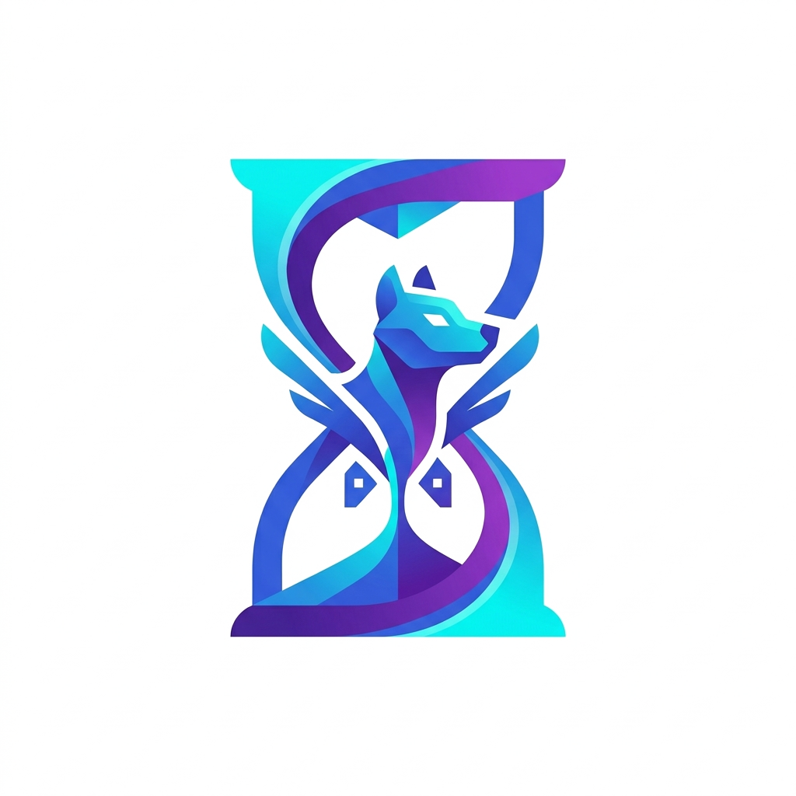
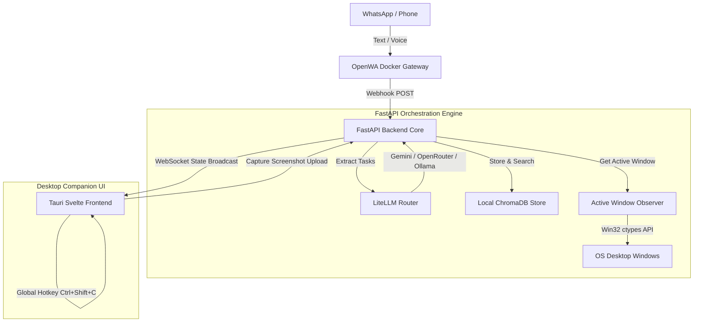

<p align="center">
  
</p>

<h1 align="center">ChronosPet</h1>

<p align="center">
  <strong>Ambient Desktop Companion & Asynchronous Task Ingestor</strong>
</p>

<p align="center">
  <a href="https://tauri.app"></a>
  <a href="https://svelte.dev"></a>
  <a href="https://fastapi.tiangolo.com"></a>
  <a href="https://www.python.org"></a>
  <a href="https://www.rust-lang.org"></a>
</p>

---

ChronosPet is a multi-process local desktop application designed to bridge the gap between **frictionless task registration** and **active ambient accountability**. 

Traditional task managers force you to open apps, type goals, and manage boards—creating friction that leads to abandonment. ChronosPet bypasses this: you simply text or send a voice note to your personal WhatsApp bot. In the background, a transparent, hardware-accelerated desktop pet monitors your active window titles. If you stay on task, it encourages you; if you drift to YouTube or social media, it dynamically nags you, escalating its warnings as your deadline approaches. Completing tasks earns you XP, leveling up and evolving your companion drone.

---

## Key Features

* **WhatsApp Task Ingestion** — Send natural language messages or commands directly to your phone. An automated self-hosted OpenWA gateway forwards inputs to the backend.
* **AI Task Parsing & Fallbacks** — Uses a LiteLLM Router to extract structured tasks (title, absolute deadlines, priority) using robust fallbacks (Gemini $\rightarrow$ OpenRouter $\rightarrow$ local Ollama). It falls back to a regex-based local parser if offline.
* **Windows Foreground Sentinel** — Monitors focused window titles using native Win32 APIs (`GetForegroundWindow` / `GetWindowTextW`) at regular intervals (default: 30s) to detect focus state.
* **Ambient Transparent Pet** — A borderless, transparent overlay built with Tauri and Svelte. Hovering toggles click-through off so you can drag the pet; clicking it opens a control dashboard.
* **XP, Levels, and Evolutions** — Earn XP by resolving tasks. Level up to evolve your companion across five distinct growth stages: **Drone** $\rightarrow$ **Scout** $\rightarrow$ **Sentinel** $\rightarrow$ **Guardian** $\rightarrow$ **Titan**.
* **Semantic Vector Memory** — Stores task history locally in a persistent ChromaDB database. Ask your companion via WhatsApp (e.g., *"What did I finish last Thursday?"*) to query your task history.
* **Ctrl+Shift+C Vision Context Capture** — Press the system-wide global shortcut to capture a desktop screenshot. A multimodal LLM reviews the context against your active task and outputs debugging/remediation advice in the pet's dialogue bubble.
* **Configurable Personas** — Toggle between three distinct personalities that govern the pet's dialogue and tracking formulas:
  * **Cybernetic** (robotic, balanced, metric-focused)
  * **Rival** (sarcastic, mockingly combative, highly sensitive to procrastination)
  * **Zen** (calm, mindful, encouraging)

---

## Technical Architecture



---

## The Procrastination Severity Model

To trigger visual state transitions and dialogue responses objectively, the backend continuously computes the **Procrastination Severity Index ($Sp$)** during active tasks:

$$Sp = \alpha \cdot \left(\frac{T_{\text{elapsed}}}{T_{\text{deadline}} - T_{\text{start}}}\right) + \beta \cdot D_{\text{weight}} + \gamma \cdot (1 - \eta)$$

Where:
* $\alpha, \beta, \gamma$ are normalized persona-specific weights configured in `config.json` ($\alpha + \beta + \gamma = 1.0$).
* $T_{\text{elapsed}}$ is the active duration since the task started.
* $T_{\text{deadline}} - T_{\text{start}}$ is the total time window allocated for the task.
* $D_{\text{weight}}$ is the deviation weight of the active foreground window:
  * **Deviant** (e.g., YouTube, Reddit, Discord) = `0.9`
  * **Neutral** (unknown application/browser) = `0.3`
  * **Task-Specific Coherence** (dynamic match with task keywords) = `0.05`
  * **Compliant** (e.g., IDE, Terminal, Docs) = `0.0`
* $\eta$ represents your recent productivity index (completed tasks over the last 30 minutes).

### Behavioral State Transitions
* **$Sp \le 0.4$** $\rightarrow$ `focus_mode_active` (Calm blue visual state).
* **$Sp > 0.4$** $\rightarrow$ `nagging_mild` (Yellow warning glow; minor companion shaking).
* **$Sp > 0.7$** $\rightarrow$ `nagging_severe` (Red critical state; intense companion shaking, click-through disabled briefly, active nags).

---

## Getting Started

### Prerequisites
* **Node.js** (v18+) and **npm**
* **Python** (3.11+)
* **Rust** (cargo & rustc for Tauri) — [Setup Guide](https://tauri.app/v1/guides/getting-started/prerequisites)
* **Docker** (optional, for WhatsApp gateway)

---

### Installation

1. **Clone the Repository**
   ```bash
   git clone https://github.com/ASIKKANI/Antenna.git
   cd Antenna
   npm install
   ```

2. **Setup the Python Backend**
   ```bash
   cd backend
   python -m venv venv
   
   # Windows
   .\venv\Scripts\activate
   # macOS/Linux
   source venv/bin/activate
   
   pip install -r requirements.txt
   ```

3. **Configure Settings**
   Configure your preferred model, authorized phone number, and persona profile in `config.json` in the project root:
   ```json
   {
       "selected_provider": "gemini",
       "target_model_name": "gemini-1.5-flash",
       "authorized_phone_number": "YOUR_PHONE_NUMBER_WITH_COUNTRY_CODE",
       "active_persona_profile": "cybernetic"
   }
   ```
   Provide your API key as an environment variable in your terminal:
   ```bash
   # Windows (CMD)
   set GEMINI_API_KEY=your-api-key-here
   # Windows (PowerShell)
   $env:GEMINI_API_KEY="your-api-key-here"
   # macOS/Linux
   export GEMINI_API_KEY="your-api-key-here"
   ```

---

## Running the Application

Running ChronosPet requires running the backend orchestration engine alongside the Tauri frontend client:

### Step 1: Start the Backend Core
Open a terminal in the `backend` folder and run:
```bash
uvicorn main:app --host 0.0.0.0 --port 8000 --reload
```

### Step 2: Start the Tauri Desktop App
Open a new terminal in the project root and run:
```bash
npm run tauri dev
```
This launches the Svelte dev server and boots the transparent desktop overlay window.

### Step 3: Start the WhatsApp Gateway (Optional)
Make sure Docker is running on your machine, then execute this command in the repository root:
```bash
docker-compose up openwa
```
Scan the QR code printed in the container terminal logs with your phone's WhatsApp client to link the gateway.

---

## Running Tests

To verify that the webhook parser, Sentinel observers, and mathematical models operate correctly, execute the test suite in the `backend` folder:
```bash
.\venv\Scripts\python.exe -m pytest test_webhook.py -v
```

---

## Project Structure

```
Antenna/
├── src/                    # Svelte frontend UI
│   ├── App.svelte          # Main overlay and dashboard UI
│   ├── app.css             # Tailwind & design system
│   ├── main.ts             # Svelte entry point
│   └── lib/
│       ├── websocket.ts    # Reconnecting WS client
│       └── tauri.ts        # Tauri Rust command wrappers
├── src-tauri/              # Tauri C++ / Rust Desktop wrapper
│   ├── src/main.rs         # Win32 click-through, resizing, global hotkey listener
│   ├── tauri.conf.json     # Tauri configuration (transparent window setup)
│   └── Cargo.toml          # Rust dependencies
├── backend/                # FastAPI Python Server
│   ├── main.py             # Event loop, Webhook endpoints, LiteLLM router
│   ├── models.py           # Pydantic schemas (Task, Config, State)
│   ├── sentinel.py         # Win32 ctypes active window tracker & Sp math
│   ├── turbovec.py         # ChromaDB persistence memory client
│   └── test_webhook.py     # Backend Pytest coverage
├── gateway/                # OpenWA WhatsApp Node Gateway
│   ├── index.js            # Express webhook router
│   └── Dockerfile          # Headless Puppeteer environment
├── config.json             # Configuration registry
└── docker-compose.yml      # Multi-process container configuration
```

---

## License

This project is licensed under the MIT License. See [LICENSE](LICENSE) for details.
