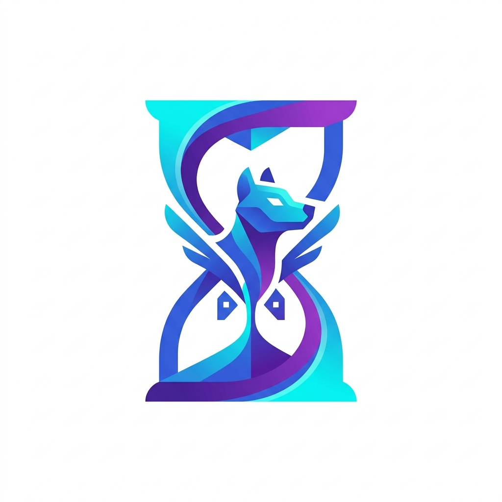
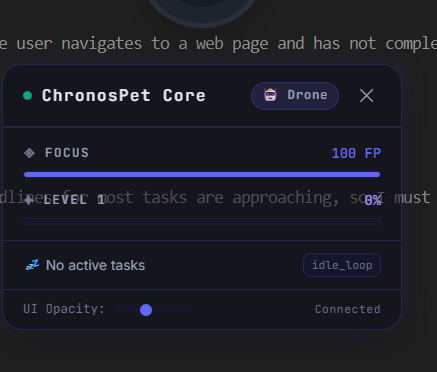
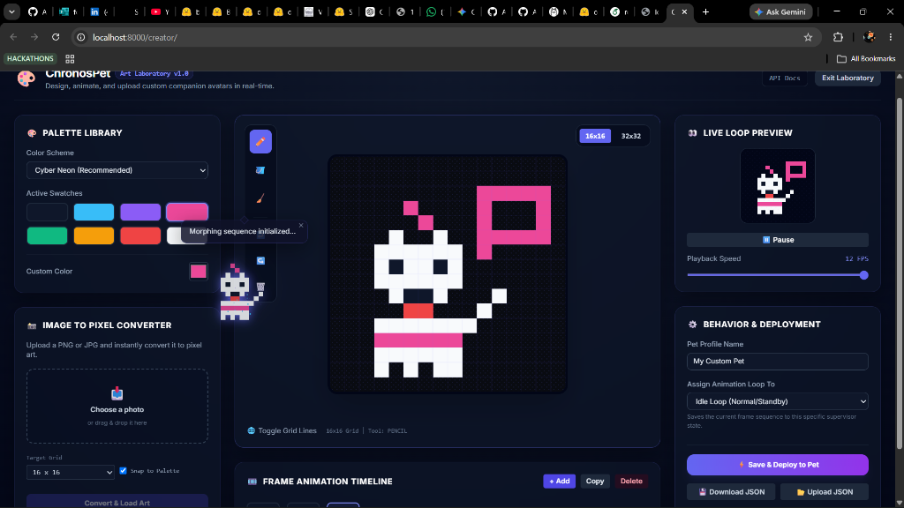
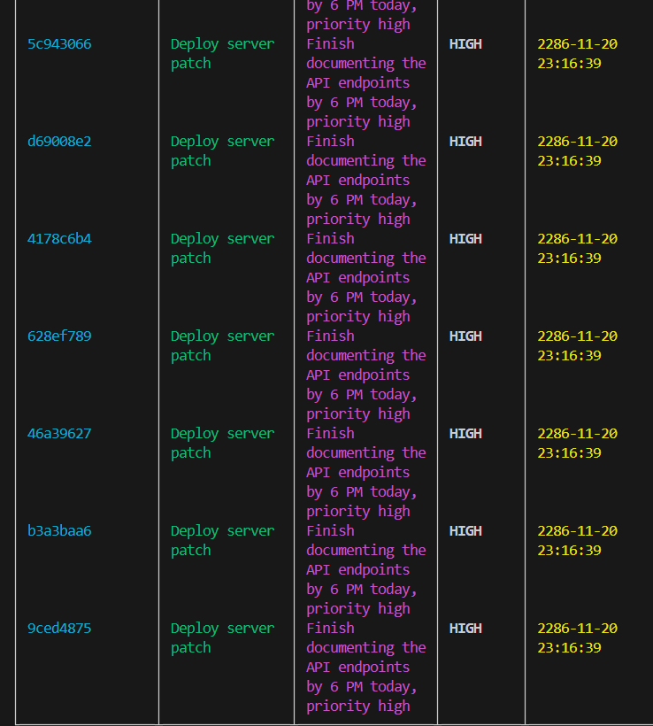
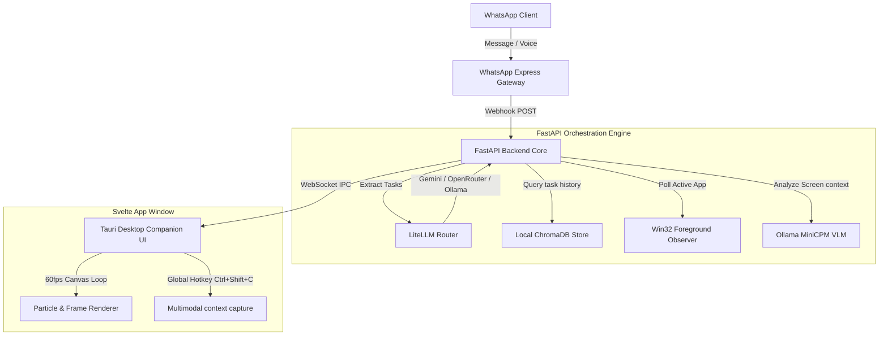
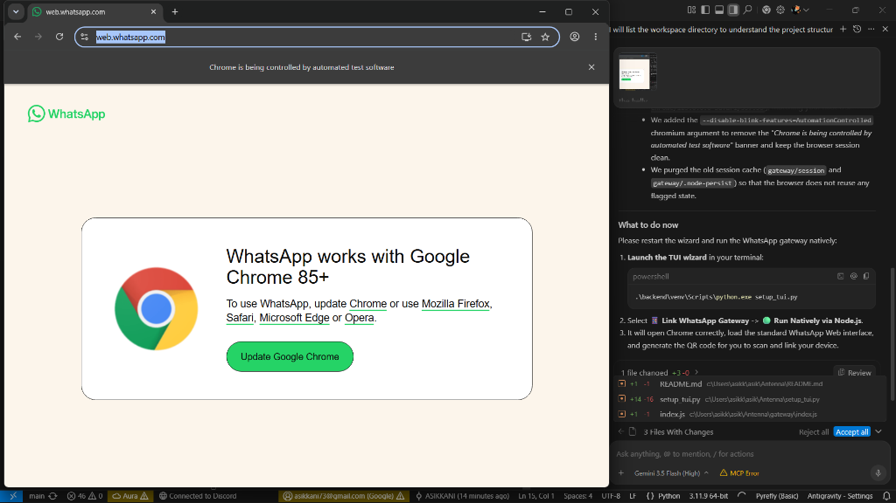

<p align="center">
  
</p>

<h1 align="center">ChronosPet</h1>

<p align="center">
  <strong>Ambient Desktop Companion & Asynchronous Task Accountability Engine</strong>
</p>

<p align="center">
  <a href="https://tauri.app"></a>
  <a href="https://svelte.dev"></a>
  <a href="https://fastapi.tiangolo.com"></a>
  <a href="https://www.python.org"></a>
  <a href="https://www.rust-lang.org"></a>
  <a href="https://github.com/ASIKKANI/Antenna/blob/main/LICENSE"></a>
  
</p>

---

## 🌟 Overview

**ChronosPet** is a premium local desktop companion designed to bridge the gap between **frictionless task registration** and **active ambient accountability**.

Traditional task managers fail because of friction—opening boards, logging goals, and clicking boxes gets abandoned. ChronosPet changes this:
1. **Tell Your Companion:** Simply text or send a voice note to your personal self-hosted WhatsApp bot (e.g. *"finish homework by 5pm today"*).
2. **AI Action Extraction:** The system automatically extracts titles, priorities, and deadlines, registering them in a local vector task store.
3. **Ambient Accountability:** A beautiful, borderless, transparent desktop pet monitors your screen activity using local vision models (MiniCPM) and native APIs.
4. **Interactive Motivation:** If you stay focused, the companion bobs calmly in focus mode. If you drift to YouTube or social media, it shakes, turns warning red, and nags you, escalating dialogue severity as your deadline approaches!

---

## 📸 Screen Gallery

### 1. Interactive Desktop Companion Dashboard
A transparent, drag-and-drop desktop widget that overlay's your screen. Clicking it reveals the glassmorphism control panel.
<p align="center">
  
</p>

### 2. Standalone Pixel Art Customization Laboratory
Serve served at `http://localhost:8000/creator`. Create custom avatars, paint pixel grids, build frame-by-frame animation loops, mirror/rotate arrays, and convert high-resolution photos into quantized pixel palettes.
<p align="center">
  
</p>

### 3. Setup TUI & Persistent Task Store
Manage background processes, configure local/paid LLMs, check link status, and explore task vectors in vector memory.
<p align="center">
  
</p>

---

## 🚀 Key Features

* **📱 WhatsApp Task Ingestion:** Send tasks or voice notes directly to your companion. The self-hosted Node gateway routes messages to the FastAPI core.
* **🧠 Multi-Agent Supervisor:** Screen context is parsed by a local **MiniCPM VLM** (Perception Agent), which is then evaluated against your active tasks by a paid/local model (Cognitive Agent) to determine focus weight and trigger animations.
* **🧸 Play & Care Gamification:** Pet your companion (`+10 XP`) or feed it treats (`+25 XP`) directly from the widget to display animated floating hearts and treat cookie crumbs while leveling up your drone companion.
* **🛠️ Symmetrical Transform Tools:** Flip, rotate, and shift pixel grids instantly inside the Art Lab.
* **🌟 Dynamic Dialogue & Personas:** Toggle between **Cybernetic** (robotic/precise), **Rival** (sarcastic/combative), and **Zen** (mindful/calming) to customize dialogue.
* **🔍 Scrollable Vector Search:** Task history is persisted inside a local `ChromaDB` instance. Ask your companion via WhatsApp (e.g. *"what did I finish yesterday?"*) to query vector search records.

---

## 🛠️ System Architecture



---

## 📐 Procrastination Severity Model

The Cognitive Agent continuously calculates the **Procrastination Severity Index ($Sp$)** during active tasks using the following mathematical model:

$$Sp = \alpha \cdot \left(\frac{T_{\text{elapsed}}}{T_{\text{deadline}} - T_{\text{start}}}\right) + \beta \cdot D_{\text{weight}} + \gamma \cdot (1 - \eta)$$

Where:
* $\alpha, \beta, \gamma$ are normalized weights defined per persona profile ($\alpha + \beta + \gamma = 1.0$).
* $T_{\text{elapsed}}$ represents time spent on the active task.
* $T_{\text{deadline}} - T_{\text{start}}$ is the total duration allocated for the task.
* $D_{\text{weight}}$ is the active screen context deviation coefficient:
  * **Deviant** (e.g. gaming, YouTube, Reddit) = `0.8 - 1.0`
  * **Neutral** (unknown application or tab) = `0.3`
  * **Coherent** (tab contents match task keywords) = `0.05`
  * **Compliant** (e.g. IDE, terminals, documentation) = `0.0`
* $\eta$ is your recent productivity index (ratio of completed tasks within the last 30 minutes).

### Behavioral States
* **$Sp \le 0.4$** $\rightarrow$ `focus_mode_active` (Calm blue hue; smooth floating).
* **$Sp > 0.4$** $\rightarrow$ `nagging_mild` (Yellow glow; minor shaking, warning dialogues).
* **$Sp > 0.7$** $\rightarrow$ `nagging_severe` (Critical red alert; intense shaking, click-through locks, aggressive nags).

---

## 🏁 Getting Started

### Prerequisites
* **Python 3.11+**
* **Node.js v18+** & **npm**
* **Rust** (cargo & rustc to build Tauri) — [Tauri Prerequisites Guide](https://tauri.app/v1/guides/getting-started/prerequisites)
* **Ollama** (optional, for offline local VLM)

---

### Quick Installation

1. **Clone the Repository**
   ```bash
   git clone https://github.com/ASIKKANI/Antenna.git
   cd Antenna
   npm install
   ```

2. **Initialize Python Virtual Environment**
   ```bash
   cd backend
   python -m venv venv
   .\venv\Scripts\activate
   pip install -r requirements.txt
   ```

3. **Launch the TUI Setup Wizard**
   From the repository root, run:
   ```bash
   .\backend\venv\Scripts\python.exe setup_tui.py
   ```
   > [!TIP]
   > Use this terminal wizard to set up LLM routing, scan your WhatsApp Web gateway QR code, check service diagnostics, toggle Vision AI, and inspect ChromaDB vector stores!

---

### Running the Services

1. **Start the Backend Engine**
   ```bash
   cd backend
   ..\backend\venv\Scripts\uvicorn main:app --host 127.0.0.1 --port 8000 --reload
   ```

2. **Link WhatsApp Gateway**
   Run the gateway natively via Node from the root directory:
   ```bash
   node gateway/index.js
   ```
   > [!IMPORTANT]
   > Scan the QR code printed in the terminal with WhatsApp (Linked Devices) to authorize task ingestion.
   
   <p align="center">
     
   </p>

3. **Launch the Tauri Widget UI**
   ```bash
   npm run tauri dev
   ```

---

## 🧪 Testing

Execute the comprehensive test suite inside the `backend` folder to verify parsing, database, and compliance mechanics:
```bash
.\venv\Scripts\python.exe -m pytest test_webhook.py -v
```

---

## 📁 Project Structure

```
Antenna/
├── src/                    # Svelte overlay application
│   ├── App.svelte          # Main companion widget & dashboard
│   └── app.css             # Tailwind & premium glass theme
├── src-tauri/              # Rust desktop wrapping layer
│   ├── src/main.rs         # Win32 click-through handles & global hotkeys
│   └── tauri.conf.json     # Windows opacity & size config
├── backend/                # FastAPI Python core
│   ├── main.py             # Event loops, REST routing, websockets
│   ├── sentinel.py         # Win32 process trackers & Sp calculator
│   ├── agent_system.py     # Perception / Cognitive double-agent system
│   ├── vision_analyzer.py  # Screen captures & Ollama VLM adapters
│   └── test_webhook.py     # Test suite
├── gateway/                # Express WhatsApp Node Bridge
│   └── index.js            # OpenWA handler
├── images/                 # Screenshot assets
└── setup_tui.py            # Terminal setup dashboard
```

---

## 📄 License

This project is licensed under the MIT License - see the [LICENSE](LICENSE) file for details.
